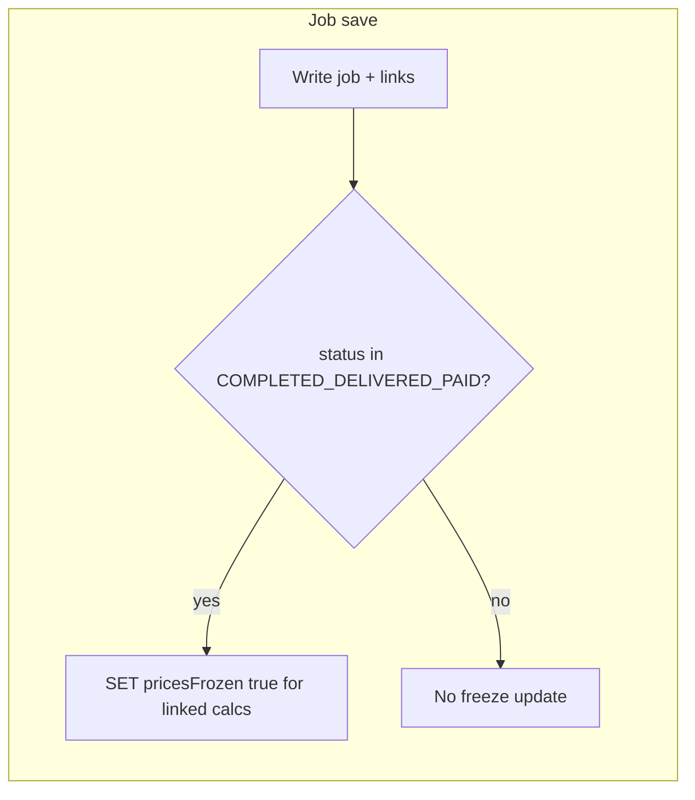

# Freeze calculation prices when job is completed (and related statuses)

## Behavior (confirmed)

- **Freeze** all calculations currently linked to a job when that job’s `status` is `**COMPLETED`**, `**DELIVERED`**, or `\*\*PAID\*\*`(set`pricesFrozen = true` for those calculation IDs).
- **Do not** auto-clear `pricesFrozen` when the job moves back to an earlier status (prices stay locked until the user explicitly unlocks on the calculation).
- **Unlock**: user **changes `calc_status`** from the value stored in DB **and** submits `**confirmUnlockPrices: true`** → allow the existing full save (including line items and all totals) and set `**pricesFrozen = false\*\`.
- **Duplicates**: new calculation should **not** inherit freeze (`pricesFrozen = false`); ensure `[duplicateCalculation](C:\Work\Mitana-ManagementSoftware\src\server\api\back-end\calculations.backend.ts)` / `[addCalculation](C:\Work\Mitana-ManagementSoftware\src\server\api\back-end\calculations.backend.ts)` never copy the flag from the source row.

## Data layer

- Add boolean column `**pricesFrozen`** (default `false`, not null) on `**calculations\*\`in`[src/server/db/schema.ts](C:\Work\Mitana-ManagementSoftware\src\server\db\schema.ts)`(mirror existing naming: e.g.`pricesFrozen`in TS maps to snake case if your convention uses it—match neighboring columns like`sumTotalCents`).
- Add a **Drizzle migration** under `[drizzle/](C:\Work\Mitana-ManagementSoftware\drizzle)` (same pattern as existing migrations).

## Job backend: when to freeze

- In `[src/server/api/back-end/jobs.backend.ts](C:\Work\Mitana-ManagementSoftware\src\server\api\back-end\jobs.backend.ts)`, after job–calculation links are persisted in `**addJob`** and `**editJobById\*\` (same transaction as today):
  - If final `job.status` ∈ `{ COMPLETED, DELIVERED, PAID }`, run `UPDATE calculations SET prices_frozen = true WHERE id IN (...)` for **all** calculation IDs currently linked to that job (including newly linked calcs on an already-frozen-status job).
- Reuse `JobStatus` enum from `[schema.ts](C:\Work\Mitana-ManagementSoftware\src\server\db\schema.ts)` (lines 27–35) for the allowlist.

## Calculation backend: `editCalculationById`

Current implementation always updates pricing columns and **deletes/reinserts** `[calculationDataItems` / `calculationAdditionalDataItems](C:\Work\Mitana-ManagementSoftware\src\server\api\back-end\calculations.backend.ts)` (see ~900–997). Frozen mode must avoid that unless unlocking.

**Recommended logic** (clear rules, minimal ambiguity):

1. Load `existingCalculation` (already done). Read `**existingCalculation.pricesFrozen`** and `**existingCalculation.status\*\*`.
2. **If `pricesFrozen` is false**: keep current behavior (full update + replace children).
3. **If `pricesFrozen` is true**:

- **Unlock branch**: `calculation.calc_status !== existingCalculation.status` **and** `confirmUnlockPrices === true`  
  → full update as today, plus `**pricesFrozen: false` in the header `.set()`.
- **Status changed but no confirm**: throw a **structured tRPC-friendly error** (e.g. `TRPCError` with `code: "BAD_REQUEST"` and a dedicated `message` / `cause` key like `CALCULATION_UNLOCK_PRICES_CONFIRM_REQUIRED`) so the client can show the confirm dialog and retry.
- **Status unchanged**:
  - If payload **differs** from DB on any **price or line-item** field (all `price_*`, `areas_grandtotal`, `data_array`, `additional_data_array`—compare to a normalized snapshot from `**getCalculationById(id)`** or an inline equivalent) → **reject (prices locked).
  - If only **safe header** fields changed (`name`, `date`, `statusDate`, orderer fields, `note`, optionally `subjectId`—decide once and document): **narrow `update(calculations).set(...)`** with **no** delete/insert of line items.

**Signature change**: extend `[editCalculationById](C:\Work\Mitana-ManagementSoftware\src\server\api\back-end\calculations.backend.ts)` to accept `options: { confirmUnlockPrices?: boolean }` (default `false`).

## Router

- In `[src/server/api/routers/calculationsRouter.ts](C:\Work\Mitana-ManagementSoftware\src\server\api\routers\calculationsRouter.ts)`, change `editCalculationById` input to:

`z.object({ id, calculation: addCalculationValidator(), confirmUnlockPrices: z.boolean().optional() })`

and pass the flag into the backend.

## Read APIs and types

- `**[CalculationViewData](C:\Work\Mitana-ManagementSoftware\src\server\api\back-end\calculations.backend.ts)`** + `[getCalculationViewById](C:\Work\Mitana-ManagementSoftware\src\server\api\back-end\calculations.backend.ts)`: add `**pricesFrozen: boolean\*\` so list/detail views can show state if needed.
- `**[getCalculationById](C:\Work\Mitana-ManagementSoftware\src\server\api\back-end\calculations.backend.ts)`** / `[TAddCalculationValidator](C:\Work\Mitana-ManagementSoftware\src\features\calculations\addDialog\addCalculationValidator.ts)`: add optional `**calc_prices_frozen`** (or match your naming) **read-only for the form—extend Zod with `.optional()`defaulting when missing for backward compatibility; map in the object built ~479 in`calculations.backend.ts`.
- `**[calculationFormTransformers.ts](C:\Work\Mitana-ManagementSoftware\src\features\calculations\addDialog\calculationFormTransformers.ts)`: carry `pricesFrozen` into form state (e.g. `pricesFrozen` on `[TCalculationFormData](C:\Work\Mitana-ManagementSoftware\src\features\calculations\addDialog\calculationFormSchema.ts)` if defined there) so the UI can disable inputs.

## UI: `[CalculationForm.tsx](C:\Work\Mitana-ManagementSoftware\src\features\calculations\addDialog\CalculationForm.tsx)`

- When `**pricesFrozen` is true:
  - Disable **all price-driving controls** (totals, per-area, discount, material/labor/subject price fields, coefs, amounts that feed totals—match what the server treats as “price payload”).
  - Show a short **banner** (existing Alert/Callout pattern) explaining prices are locked because the calculation was linked to a completed job.
- On submit:
  - If user **changed status** vs initial load **and** `pricesFrozen` was true, show `**AlertDialog`** warning that saving will **unlock prices**; on confirm, call mutation with `**confirmUnlockPrices: true`.
- If mutation returns `**CALCULATION_UNLOCK_PRICES_CONFIRM_REQUIRED` (or chosen code), open the same dialog and retry after confirm.

## i18n

- Add keys to `[src/language/lang/en.json](C:\Work\Mitana-ManagementSoftware\src\language\lang\en.json)` and `[src/language/lang/sk.json](C:\Work\Mitana-ManagementSoftware\src\language\lang\sk.json)` for banner title/body and unlock confirm title/body/buttons.

## Edge case (document in code comment)

- Removing a calculation from a completed job **does not** clear `pricesFrozen` (by design). Unlock remains **only** via status change + confirm on the calculation.

## Testing checklist (manual / quick)

- Job → COMPLETED: linked calcs get `pricesFrozen`; opening calculation: prices read-only; changing note/name saves without touching lines.
- Attempt price change while frozen: server rejects.
- Change status + confirm: full save works, `pricesFrozen` false, prices editable again.
- Change status without confirm: error, then retry with flag succeeds.
- Duplicate: new calc is not frozen.
